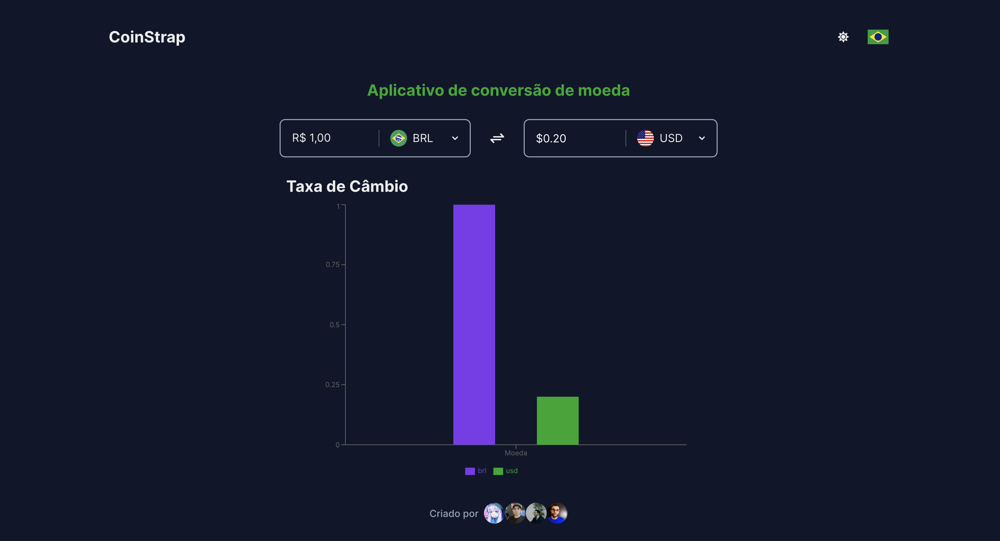

# 💱 Side Project CoinSwap



A web-based currency converter that utilizes the AwesomeAPI to fetch exchange rate information.

## Project Description

This project was developed by a group of friends with the aim of learning and testing new skills. An online application was created to convert currencies, fetching exchange rate information using the [AwesomeAPI](https://economia.awesomeapi.com.br).

## Packages Used

- **[Vite](https://vitejs.dev/)**: Used as the bundler/build tool for the application.
- **[Chakra UI](https://chakra-ui.com/)**: UI library to streamline React-based interface development.
- **[Axios](https://axios-http.com/)**: Used for HTTP requests to the API.
- **[Framer Motion](https://www.framer.com/motion/)**: Library for animations in React.
- **[i18next](https://www.i18next.com/)**: Used for handling internationalization in the application.
- **[React Icons](https://react-icons.github.io/react-icons/)**: Icon set for React.
- **[Recharts](https://recharts.org/)**: Library for creating charts in React.

## Contributors

These users contributed to this project:
- [@iamdevmarcos](https://github.com/iamdevmarcos)
- [@milealmeida](https://github.com/milealmeida)
- [@Claytonrss](https://github.com/Claytonrss)
- [@ander0308](https://github.com/ander0308)

## Installation and Usage

To get started, clone this repository and follow the steps below:

```bash
# Clone the repository
git clone https://github.com/milealmeida/side-project-coinswap.git

# Enter the project directory
cd side-project-coinswap

# Install dependencies
npm install

# Start the application
npm run dev
